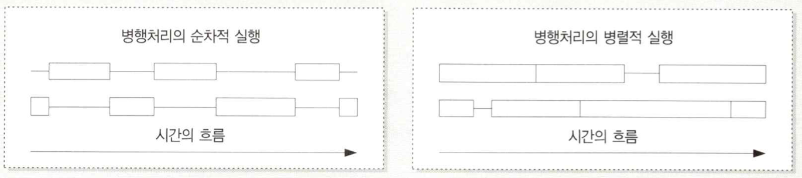
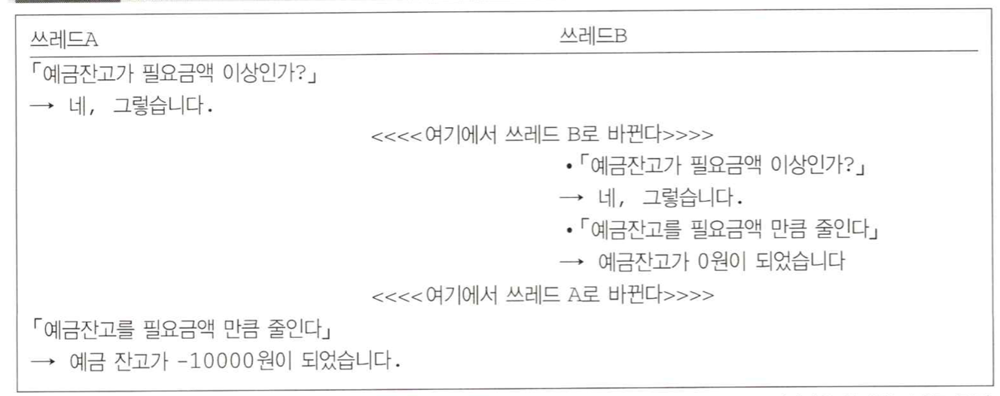
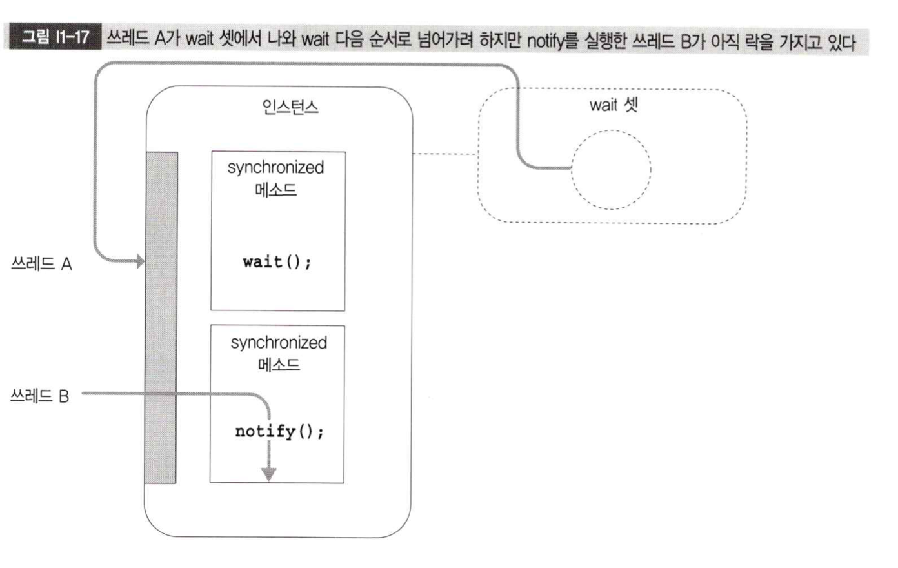

# Java 멀티 쓰레드 디자인패턴

## Introduction 01

### 쓰레드란 무엇인가 - 1

* start 메소드를 실행해야 자바에서 새로운 쓰레드를 만들어준다
* start 메소드가 실행되면서 run 메소드를 같이 실행해준다
* 따라서 run 메소드를 실행하면 쓰레드가 생성되지 않는다

순차(sequential), 병렬(parallel), 병행(concurrent) 용어 정리

* 순차: 말그대로 순차적으로 실행
* 병렬: 10개의 업무를 2개가 분담하여 실행
* 병행: 어떤 한 task를 어떤 순서로 처리해도 상관없이 여러개의 작업으로 분할, 아래 이미지 참고
  * 예를 들어 cpu가 하나라면 두개의 업무를 마치 하나의 병렬처리하듯이 왔다갔다...
  * cpu가 두개라면 두번째 이미지처럼 같은 시간동안에 task를 말그대로 동시에 실행할 수 있다

<figure><figcaption></figcaption></figure>

### 쓰레드 베타제어 - 5

돈을 입출금하는 로직이 있을 때 로직상으로 데이터를 체크하고 입출금하는 로직이 문제가 없지만 쓰레드가 concurrent로 처리되면 두개의 쓰레드가 우연히 조건문에 둘다 들어가서 조건에 부합하지 않는데도 로직을 실행할 가능성이 있다.

<figure><figcaption></figcaption></figure>

이를 방지하려면 syncronized 키워드를 메소드 앞에 붙여서 방지할 수 있다. syncronized 를 붙이면 다른 쓰레드가 실행중인 동일한 인스터스의 메소드에 바로 접근하지 못하고 기다려야만 한다.

다른 쓰레드가 접근할 수 없는 것을 락(Lock)이라고 한다. 락에 걸린 상태에서는 synchronized 메소드에 접근할 수 없고 release 될때까지 기다려야한다. release 되면 기다리고 있는 쓰레드들 중에서 하나만 락을 획득(acquire)할 수 있다. 락은 인스턴스마다 존재한다. 따라서 어떤 인스턴스의 synchronized 메소드를 실행할 수 없다고 해서 다른 인스턴스의 synchornized 메소드 또한 실행할 수 없는 것은 아니다.

### 쓰레드의 협조 - 6

wait, notify, notifyAll

* 모든 인스턴스는 wait set을 가진다
  * wait set은 물리적으로 어떤 공간을 가지는게 아니라 그냥 논리적으로 생각해보자는 의미에에서 wait set이라고 일단 명명한다.
* 한 인스턴스의 synchronized 메소드에서 wait() 을 실행하게 되면 해당 쓰레드는 wait set으로 들어간다
* wait()을 실행하고 있을 때는 락을 취하고 있어야하고, wait set 으로 들어갈땐 락을 해제한다
* 락이 해제되고 다른 쓰레드가 해당 인스턴스의 다른 synchronized 메소드에서 notify() 를 실행했다고 가정해보자
* notify()를 실행할떄 또한 락을 취하고 있어야한다. notify()를 실행하면 wait set에 들어기있는 쓰레들 중에 하나를 깨운다.
  * 어느 쓰레드를 깨울진 모르지만 어쨌든 한 쓰레드를 깨운다.
* 인스턴스에 notify()를 실행한 쓰레드가 락을 취하고 있기 때문에 깨워진 쓰레드가 바로 wait() 다음 동작을 하는 것은 아니다.
* 락을 취하고 있는 쓰레드가 작업을 종료하고 락을 해제하면 비로소 wait() 다음 로직을 실행할 수 있다.
* notifyAll()은 모든 쓰레드를 깨우는 것이다.
* notify, notifyAll 중 어느 것을 선택할것이냐?
  * notifyAll 이 리소스를 더 많이 쓰긴 하지만 notify를 사용할땐 문제가 발생할 수 있기때문에 일단 notifyAll 을 사용하도록 하자.

<figure><figcaption></figcaption></figure>
